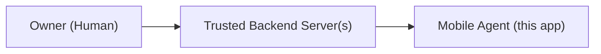

# Agent Charter — Supreme Authority Document

> **This document defines WHY this agent exists.**
> It supersedes all implementation decisions and feature requests that conflict with its purpose.

---

## The Problem This Agent Solves

Modern backend systems require interactions that involve:

1. **Human-in-the-loop approval** — A real human must explicitly approve a sensitive action before it proceeds (e.g., login from a new device).
2. **Physical SIM-based delivery** — Delivering OTP SMS messages requires a real SIM card connected to a cellular network, something no cloud server can do natively without a third-party gateway.
3. **Offline bank SMS monitoring** — Bank payment confirmations arrive as SMS messages on a registered phone number. Automated systems cannot read them without physical device access.

All three problems share a common root: **they require a trusted physical device with elevated hardware access**.

This agent is the solution.

---

## The Core Mandate

> **Provide a cryptographically identified, hardware-bound execution surface that allows one or more trusted backend systems to perform actions that require a physical mobile device — without delegating any decision-making authority to that device.**

Every design decision, capability boundary, and security constraint in this system exists to fulfill this mandate.

---

## Why a Mobile Agent, Not a Server?

| Requirement | Cloud Server | Mobile Agent |
| --- | --- | --- |
| Push notification approval dialog | ❌ Cannot show native UI | ✅ |
| Send SMS via SIM | ❌ Requires paid gateway | ✅ Free, direct |
| Read incoming bank SMS | ❌ No hardware access | ✅ With permissions |
| Device-bound key | ❌ Not possible | ✅ Android Keystore |
| User is present for approval | ❌ No | ✅ Yes |

---

## Why Not a Consumer App?

Consumer apps are designed for anonymous, untrusted users at scale. This agent is the opposite:

- **Single owner, single device** (or explicitly paired set of devices)
- **No anonymous users**
- **No public sign-up**
- **No App Store distribution**
- **Full owner control over every aspect of deployment**

Publishing this app publicly would be a **security violation**, not a convenience.

---

## The Principal Hierarchy



```txt
Owner (Human)
    │
    ▼
Trusted Backend Server(s)
    │
    ▼
Mobile Agent (this app)
```

The owner controls the server. The server controls the agent. The agent controls the device hardware. At no point does the agent have authority to override or bypass the server's decisions.

---

## What Justifies Adding a New Capability

A new capability may be considered only if ALL of the following are true:

1. It requires physical mobile hardware (SIM, camera, biometrics, location).
2. It cannot be safely delegated to a cloud service.
3. The decision authority remains entirely on the server.
4. It fits within the Clean Architecture layering model.
5. It does not create dependencies between existing capabilities.
6. It has been explicitly approved in `CONSTITUTION/04_change_policy.md`.

If any condition fails, the capability does not belong in this agent.

---

## What This Charter Does Not Do

This charter does not:

- Define API schemas (see `SERVER_CONTRACTS/`)
- Define implementation patterns (see `ARCHITECTURE/`)
- Define security mechanisms (see `SECURITY/`)
- Define what the agent may output (see `OUTPUT_CONTROL/`)

---

_This charter may only be modified by following the process in `CONSTITUTION/04_change_policy.md`._
